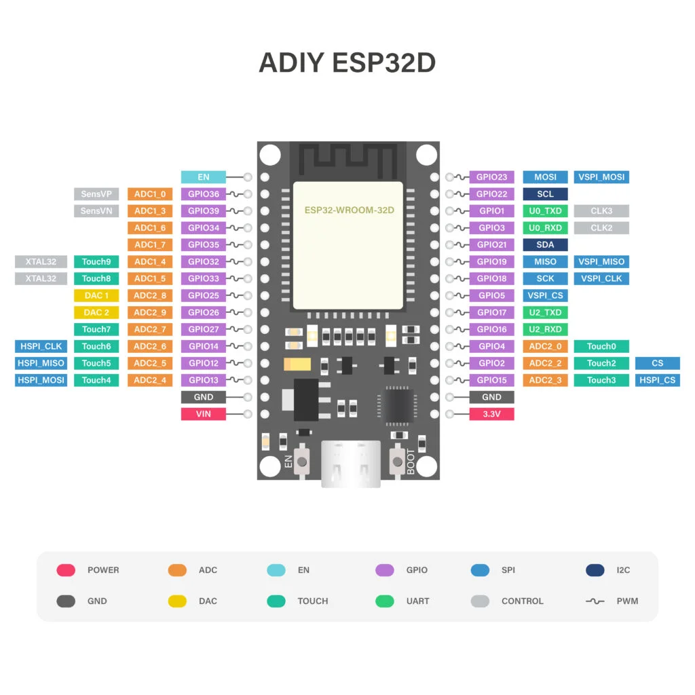

# Radio Control Truck (ESP32 + Flutter)

Projeto de controle remoto de caminhão que combina firmware ESP32 por BLE e aplicativo Flutter para Android/iOS.

## 📌 Visão Geral

- `ESP32/Radio_control.ino`: firmware para ESP32 com:
  - conexão BLE (GATT)
  - controle de LEDs RGB (vermelho, verde, azul)
  - sensor ultrassônico HC-SR04 (mapeia distância de ré)
  - buzzer com alerta de proximidade e modo SOS (piscadas + buzzer em Morse)
  - notificações BLE de distância ao app
- `lib/main.dart`: app Flutter com BLE usando `flutter_blue_plus`, integração Firebase e UI rápida.
- `firebase_options.dart`: configuração de inicialização Firebase.

## 📸 Imagens do Projeto

### Aplicativo Flutter


### Hardware ESP32


## ⚙️ Funcionalidades

### ESP32
- Publica serviço BLE com UUID `12345678-1234-1234-1234-123456789abc`
- Característica LED (escrita): `abcdefab-1234-1234-1234-abcdefabcdef`
  - comandos: `LED:VERMELHO:1`, `LED:VERMELHO:0`, etc.
  - comando SOS: `SOS:1` / `SOS:0`
- Característica distância (notificação): `abcdefef-1234-1234-1234-abcdefabcdef`
- Leitura de sensor HC-SR04 (TRIG 23, ECHO 22), buzzer (pino 5)
- Sistema de alerta de corpo inteiro SOS Morse

### Flutter App
- Scan, conexão e desconexão BLE
- Controle de LEDs e disparo SOS remoto
- Exibe distância recebida e status de proximidade
- Salva eventos SOS no Firestore (`sos_eventos`)
- Histórico em tempo real com StreamBuilder

## 🧩 Pré-requisitos

- ESP-32D-N4XX (placa) com PlatformIO
- Flutter 3.x/4.x instalado
- Android Studio + SDK (ou iOS Xcode)
- Google Firebase configurado no projeto
- Dependências Flutter:
  - `flutter_blue_plus`
  - `permission_handler`
  - `firebase_core`
  - `cloud_firestore`

## 🚀 Configuração

### 1. ESP32
1. Abra `ESP32/Radio_control.ino` na PlatformIO / Arduino IDE.
2. Configure `Tools > Board > ESP32 Dev Module` e porta serial correta.
3. Faça upload.

### 2. Flutter
1. Abra terminal em `truck_control`.
2. Ative Firebase:
   - Mantenha `lib/firebase_options.dart` gerado pelo Firebase CLI.
3. Instale dependências:
   - `flutter pub get`
4. Conceda permissões BLE em AndroidManifest (API 31+):
   - `BLUETOOTH_SCAN`, `BLUETOOTH_CONNECT`, `ACCESS_FINE_LOCATION`, `BLUETOOTH_ADVERTISE` (se necessário)
5. Execute:
   - `flutter run`

## 📱 Uso

1. Inicie o ESP32 e verifique serial: `ESP32 pronto!`.
2. Abra app e toque em "Escanear".
3. Conecte no dispositivo `ESP32-Caminhao`.
4. Use botões para alternar LEDs e SOS.
5. Veja o sensor de ré atualizar cores/níveis.
6. SOS gera evento em Firestore com data/hora.

# Arquitetura
```
[ Flutter App ]  <--BLE-->  [ ESP32 ]
       │                         │
       │                         ├── LEDs RGB
       │                         ├── Sensor HC-SR04
       │                         └── Buzzer
       │
       └── Firebase (Firestore)
```

## 🗂️ Estrutura do projeto

```
truck_control/
├── android/                    # Configurações nativas Android
├── ios/                        # Configurações nativas iOS
├── lib/                        # Código fonte Flutter
│   ├── main.dart              # App principal
│   └── firebase_options.dart  # Configuração Firebase
├── ESP32/                      # Firmware ESP32
│   └── Radio_control.ino      # Código do microcontrolador
├── test/                       # Testes unitários Flutter
├── pubspec.yaml               # Dependências Flutter
├── firebase.json              # Configuração Firebase
└── README.md                  # Este arquivo
```

## 📝 Observações

- O modo SOS no app aciona `SOS:1`/`SOS:0` e registra eventos no Firestore.
- O firmware prioriza SOS sobre aviso de ré no buzzer.
- A característica de distância somente notifica quando conectado.

---

Feito com Flutter + ESP32 para controle de caminhão por BLE e monitoramento de segurança.
